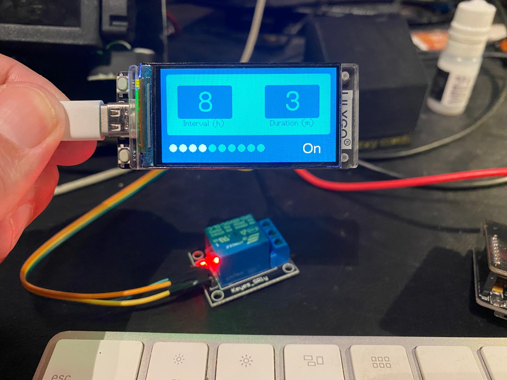

# Timer Project with T-Display S3

## Overview

This project implements a timer using the T-Display S3, allowing users to set a duration (in minutes) and an interval (in hours). The display shows the timer countdown, interval, duration values, and status (on/off).


## Features

- **Set Timer Duration**: Users can set the timer duration in minutes.
- **Set Interval**: Users can set the interval period in hours.
- **Display Information**: The T-Display S3 shows the current countdown progress, interval, duration values, and the timer status (on/off).
- **User-friendly Interface**: Easy to use interface for setting and controlling the timer.

## Hardware Requirements

- **T-Display S3**: ESP32-based microcontroller with built-in display.
- **Micro-USB Cable**: For power and programming.
- **Relay**: Component to control external devices based on the timer status.

## Software Requirements

- **Arduino IDE**: For writing and uploading the code.
- **T-Display S3 Libraries**: Ensure you have the required libraries installed:
  - `TFT_eSPI`
  - `Countimer`
  - `PushButtonTaps`


## Installation

1. **Set up Arduino IDE**:
   - Download and install the [Arduino IDE](https://www.arduino.cc/en/software).
   - Install the necessary libraries via the Library Manager (Sketch -> Include Library -> Manage Libraries).

2. **Connect T-Display S3**:
   - Connect your T-Display S3 to your computer using the Micro-USB cable.

   Just remember to 

3. **Download the Project Code**:
   - Clone this repository to your local machine.
     ```bash
     git clone https://github.com/yourusername/timer-project.git
     ```

4. **Open the Project**:
   - Open the `timer-project.ino` file in the Arduino IDE.


6. **Upload the Code**:
   - Select the appropriate board and port (Tools -> Board -> ESP32 Dev Module, Tools -> Port -> [Your COM Port]).
   - Upload the code to the T-Display S3 (Sketch -> Upload).

! Can't upload any sketch，Please enter the upload mode manually.

- Connect the board via the USB cable
- Press and hold the BOOT button , While still pressing the BOOT button
- Press RST button
- Release the RST button
- Release the BOOT button (If there is no BOOT button, disconnect IO0 from GND.)
- Upload sketch
- Press the RST button to exit download mode

## Usage





### Setting Values

1. **Select Value to Change**:
   - **Long Press**: To enter selection mode, perform a long press on the button.
   - **Single Click**: Cycle through the available values types (Duration and Interval) with single clicks. The currently selected value will be highlighted on the display.

2. **Enter Edit Mode**:
   - **Long Press**: Once the desired value time is selected, perform another long press to enter edit mode.

3. **Set New Value**:
   - **Single Clicks**: Adjust the value incrementally with single clicks. Each click increases the value by one unit (minute for Duration, hour for Interval).

4. **Exit Edit Mode**:
   - **Long Press**: To exit edit mode and save the new value, perform a long press.

### Starting/Stopping Timer

1. **Start Timer**:
   - Use the interface to start the timer. The display will show the countdown progress bar and status as "ON".

2. **Stop Timer**:
   - Use the interface to stop the timer. The display will show the status as "OFF".

### Monitor Timer

- The display shows:
  - **Countdown progress bar**: Time remaining on the current timer.
  - **Interval**: The interval period set by the user.
  - **Duration**: The duration set by the user.
  - **Status**: Timer status (on/off).

### Turn Off display

- The display could be disable double click the button and enable it by click again.

### Add Relay

- You can add a relay to PIN 1 to control an external device (e.g., light, fan) based on the timer status.


## Contributing

1. Fork the repository.
2. Create a new branch (`git checkout -b feature-branch`).
3. Make your changes.
4. Commit your changes (`git commit -m 'Add new feature'`).
5. Push to the branch (`git push origin feature-branch`).
6. Open a Pull Request.

## License

This project is licensed under the MIT License. See the LICENSE file for details.

---

This README provides an overview of the Timer Project using the T-Display S3, including setup, usage, and contribution guidelines. For detailed instructions and code examples, refer to the individual code files in the repository.
